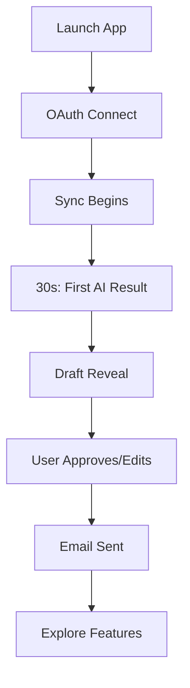
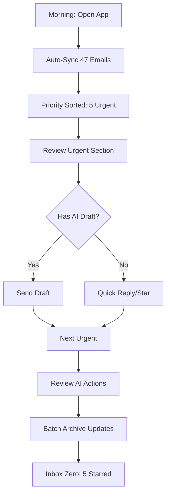

# claine-rebuild-v2 UX Design Specification

_Created on 2025-10-29 by Hans_
_Generated using BMad Method - Create UX Design Workflow v1.0_

---

## Executive Summary

**Project Vision:** Claine v2 is the first offline-first AI communication agent that brings autonomous AI assistance to professional communication while keeping all processing local for privacy. It's a cross-platform desktop application targeting privacy-conscious professionals who need powerful AI help without compromising data sovereignty.

**Target Users:** High-leverage professionals (founders, consultants, executives) handling 120+ daily emails who value privacy, need AI autonomy, and expect sub-50ms performance.

**Core Experience:** AI autonomously triages, prioritizes, drafts responses, and executes approved actions—all running locally. The "30-second wow" where users see AI value before their inbox finishes syncing.

**Platform:** Cross-platform desktop (macOS, Windows, Linux) with frameless/minimal chrome for maximum focus and perceived speed.

---

## 1. Design System Foundation

### 1.1 Design System Choice

**Decision:** shadcn/ui + Custom "Claine UI" Overrides

**Rationale:**

- **shadcn/ui** provides copy-paste components built on Radix UI + Tailwind CSS
- Full design control (source code ownership, not npm package)
- WCAG accessibility built-in (aligns with NFR008)
- Used by Linear, Arc, and other modern power-user apps
- Rapid development with extensive customization

**Component Base:** shadcn/ui (50+ components)
**Version:** Compatible with Tailwind v4 and React 19
**Icon System:** Lucide Icons (1000+ icons, 24px/2px stroke, consistent with shadcn/ui)
**Typography:** Inter Variable Font (414B+ Google Fonts accesses, optical size axis for readability)

### 1.2 Inspiration Analysis

**Primary Reference Apps:**

1. **Superhuman** (Behavioral Twin)
   - Command palette as core navigation
   - Optimistic UI (instant send/archive)
   - Sparse color; focus indicators only
   - "Delight through speed" onboarding → 30-second wow

2. **Linear** (Design System Gold Standard)
   - Deterministic spacing grid (8px rhythm)
   - Hotkey discoverability in tooltips
   - Command-palette overlays with rich previews
   - Calm dark/light pair that feels premium

3. **Raycast** (Assistant as Surface)
   - One input drives everything (⌘K paradigm)
   - Context-aware suggestions
   - Plugin/extension architecture

**Secondary Reference Apps (Privacy/Local-First):**

4. **ProtonMail/Proton Drive** (Privacy Benchmark)
   - Transparent security messaging (lock icon tooltips, "processed locally" banners)
   - Calm, factual copy tone
   - Minimal chrome with clear affordances

5. **Obsidian** (Local-First Power User)
   - Vault metaphor → "local store" UX pattern
   - Offline resilience indicators
   - Plugin system handled locally

**Tertiary Inspiration (Tone & Emotion):**

6. **Notion** (Warmth + Simplicity)
   - Gentle micro-animations (150-200ms)
   - Empty state as encouragement
   - Friendly yet neutral microcopy

7. **Arc Browser** (Reinvented Chrome)
   - Frameless window that feels native
   - Lateral navigation (sidebar + spaces)
   - Always-on context bar → Trust Meter location

---

## 2. Core User Experience

### 2.1 Design Foundation Decisions

**1. Form Factor & Window Philosophy**

- **Decision:** Frameless/minimal chrome (Option B)
- **Rationale:** Maximizes focus and perceived speed; matches power-user expectations; aligns with sub-50ms performance target
- **Guardrails:**
  - Custom draggable header with native window controls (⌘+W close, ⌘+H hide)
  - Double-click header = zoom/maximize
  - Subtle shadow + 8-12px safe padding (content never touches edges)

**2. Keyboard vs Mouse Philosophy**

- **Decision:** Keyboard-first with command palette (Option A)
- **Rationale:** Aligns with NFR008 (100% keyboard coverage), drives sub-50ms interactions, fits power-user expectations
- **Guardrails:**
  - Every core action has discoverable shortcut (shown in tooltips/menus)
  - Cmd/Ctrl+K = universal command palette with type-ahead
  - `?` key opens shortcut cheat-sheet
  - Optional shortcut trainer for onboarding

**3. AI Assistant Personality**

- **Decision:** Hybrid - invisible by default, explainable on demand (Option C)
- **Rationale:** Keeps flow calm and fast; reveals reasoning when requested to build trust
- **Guardrails:**
  - Subtle "AI" chip on items with suggestions
  - Hover/press reveals "Why" drawer with reasoning
  - No avatars/mascots; tone = helpful, concise, plain language
  - Explanations in bullets (2-4 lines), timestamped, link to action log

**4. Trust Visualization**

- **Decision:** Color-coded badges + subtle status dots with tooltips (Options B + C)
- **Rationale:** Fast at-a-glance scanning; low visual weight; maps to priority system
- **Guardrails:**
  - Confidence badges: 🟢 High / 🟡 Medium / 🔴 Low (with % in tooltip)
  - Compact pill meter in header (0-100%), click opens Permissions
  - Per-event banners only for meaningful state changes (e.g., cloud fallback engaged)

**5. Brand Voice & Visual Personality**

- **Decision:** Warm & conversational with Linear-like precision (Option B + C elements)
- **Rationale:** Feels trustworthy and human without fluff; supports dense power-user workflows
- **Guardrails:**
  - Tone: Calm, direct, reassuring ("AI suggests this because..." / "You're all set.")
  - Typography: System UI sans 14-16px, tighter letter-spacing for density
  - Color: Neutral base (light & dark modes), minimal accent for priority/confidence
  - Motion: Subtle 150-200ms ease, no decorative flourishes

### 2.2 Defining Experience

**Core Interaction:** The defining experience is **"AI autonomy with full transparency"** - users delegate email management to local AI while maintaining complete visibility and control through explainable reasoning, instant undo, and granular permissions.

**The "30-Second Wow":** Before inbox sync completes, AI shows high-priority messages with suggested drafts, demonstrating value immediately.

**Key UX Principles:**

1. **Transparency:** Every AI action shows reasoning on demand
2. **Latency:** Sub-50ms interactions feel instant (no loading states)
3. **Reversibility:** All AI actions undoable within 30 days
4. **Privacy:** Clear visual distinction between local/cloud processing
5. **Efficiency:** Keyboard-first, dense information, zero chrome waste

---

## 3. Visual Foundation

### 3.1 Color System

**Chosen Theme:** Theme 3 - Technical Calm (Obsidian precision × Raycast efficiency)

**Rationale:**

- Cyan accents signal technical precision and efficiency (matches power-user audience)
- Dark-mode-first approach aligns with developer/technical user preferences
- Calm, focused palette supports dense information without visual noise
- Differentiates from warm consumer apps while maintaining professionalism

**Color Palette:**

**Primary Colors:**

- Primary: `#06B6D4` (Cyan 500)
- Primary Dark: `#0891B2` (Cyan 600)
- Primary Light: `#22D3EE` (Cyan 400)

**Semantic Colors (Trust & Priority System):**

- Success 🟢: `#10B981` (Green 500) - High confidence, completed actions
- Warning 🟡: `#F59E0B` (Amber 500) - Medium confidence, needs attention
- Error 🔴: `#EF4444` (Red 500) - Low confidence, errors, critical
- Info 🔵: `#06B6D4` (Cyan 500) - Local processing, informational

**Neutral Scale:**

- Text Primary: `#0F172A` (Slate 900)
- Text Secondary: `#64748B` (Slate 500)
- Background: `#F8FAFC` (Slate 50)
- Border: `#CBD5E1` (Slate 300)

**Dark Mode Palette:**

- Background: `#0F172A` (Slate 900)
- Surface: `#1E293B` (Slate 800)
- Border: `#334155` (Slate 700)
- Text Primary: `#F8FAFC` (Slate 50)
- Text Secondary: `#94A3B8` (Slate 400)

### 3.2 Typography System

**Font Family:** Inter Variable Font

- **Heading:** Inter Variable, 600 weight, optical size optimized
- **Body:** Inter Variable, 400-500 weight, 14-16px
- **Monospace:** 'Courier New', monospace (for technical content, timestamps, email addresses)

**Type Scale:**

- **H1:** 24px / 600 weight / -0.02em letter-spacing
- **H2:** 20px / 600 weight / -0.01em letter-spacing
- **H3:** 18px / 600 weight / -0.01em letter-spacing
- **Body:** 14px / 400 weight / -0.01em letter-spacing (tighter for density)
- **Body Large:** 16px / 400 weight / -0.01em letter-spacing
- **Caption:** 12px / 500 weight / 0em letter-spacing
- **Monospace:** 13px / 400 weight / 0em letter-spacing

**Line Heights:**

- Headings: 1.2 (tighter for visual density)
- Body: 1.5 (readability)
- Captions: 1.4

### 3.3 Spacing & Layout

**Base Unit:** 4px (supports 8px rhythm for consistency)

**Spacing Scale:**

- xs: 4px
- sm: 8px
- md: 12px
- lg: 16px
- xl: 24px
- 2xl: 32px
- 3xl: 48px

**Layout Grid:**

- 12-column grid for flexible layouts
- 8px gutter between columns
- Container max-width: 1400px (desktop), 100% (mobile)

**Breakpoints:**

- Mobile: 0-767px
- Tablet: 768-1023px
- Desktop: 1024px+

### 3.4 Visual Style

**Visual Weight:** Balanced (clear structure, moderate visual weight)

- Not minimal (needs information density for power users)
- Not maximalist (no gradients, heavy shadows)

**Borders:** Subtle 1px borders using `#CBD5E1`

- Use sparingly for component boundaries
- Increase to 2-3px for focus states

**Shadows:**

- Subtle elevation only: `0 1px 3px rgba(0,0,0,0.1)`
- Modal overlays: `0 8px 24px rgba(0,0,0,0.15)`
- No decorative shadows

**Border Radius:**

- Small (badges, pills): 4px
- Medium (buttons, inputs): 6px
- Large (cards, panels): 8px
- Extra large (modals): 12px

**Interactive Visualizations:**

- Color Theme Explorer: [ux-color-themes.html](./ux-color-themes.html)

---

## 4. Design Direction

### 4.1 Chosen Design Approach

**Decision:** Hybrid of Direction 1 (Classic 3-Pane Dense) + Direction 2 (Command Palette First)

**Rationale:**

- Combines familiar email client pattern with innovative keyboard-driven interactions
- Zero learning curve for base layout, optional power-user acceleration via ⌘K
- Maintains information density (20+ emails visible) while providing speed path
- Spatial navigation (sidebar) + contextual navigation (command palette)
- Balances "power user from day 1" with "can grow into advanced features"

**Layout Architecture:**

**Base: 3-Pane Layout**

- **Sidebar:** 180px fixed width
  - Navigation items (Inbox, Starred, Sent, Drafts, Archive)
  - Priority labels (🔴 Urgent, 🟡 Important, 🟢 Updates)
  - Trust Meter widget (compact pill showing local AI %)
  - Collapsible for maximum content space (⌘\)

- **Email List:** 400px flexible width
  - Dense email rows with confidence badges
  - AI chips inline (subtle, on-demand reasoning)
  - Virtualized scrolling for 10,000+ emails
  - Keyboard navigation (J/K, X to select, E to archive)

- **Thread Panel:** Flexible remaining width
  - Thread detail with message history
  - AI draft panel (inline, highlighted)
  - "Why?" button reveals reasoning drawer
  - Quick actions (Reply, Archive, Snooze)

**Overlay: Command Palette (⌘K)**

- Universal search + action launcher
- Type-ahead filtering
- Context-aware suggestions
- Recent actions + shortcuts
- Overlays entire app (modal with backdrop)
- Never blocks - Esc to dismiss

**Top Bar:**

- Search input (click opens ⌘K, or type directly)
- Trust Meter (🔒 98% Local - click opens Privacy Dashboard)
- Account switcher (if multi-account)
- Settings icon

**Information Density:**

- Dense by default (Obsidian/Linear DNA)
- Email rows: ~48px height (subject + sender + preview)
- Compact padding: 8px vertical, 12px horizontal
- Tighter line-height (1.4) for captions
- Monospace for timestamps/metadata (space efficiency)

**AI Visibility:**

- Hybrid model (invisible by default, reveal on-demand)
- Confidence badges always visible (🟢/🟡/🔴)
- AI chip for items with drafts/suggestions
- Hover/click "Why?" button → inline reasoning drawer
- Draft panel prominently highlighted (cyan border)

**Keyboard-First Interaction Model:**

- **⌘K** - Command palette (universal launcher)
- **J/K** - Navigate email list
- **X** - Select/deselect email
- **E** - Archive selected
- **R** - Reply
- **A** - Reply all
- **F** - Forward
- **S** - Star/unstar
- **?** - Shortcuts cheat sheet
- \*\*⌘\*\* - Toggle sidebar
- **⌘1-9** - Switch accounts/views

**Progressive Disclosure:**

- Power users discover ⌘K naturally (search box hints it)
- Tooltips show shortcuts on hover (subtle, non-intrusive)
- Shortcut cheat sheet (? key) available anytime
- "Keyboard shortcuts" onboarding tip during 30-second wow

**Responsive Behavior:**

- Desktop (1024px+): Full 3-pane layout
- Tablet (768-1023px): Collapsible sidebar, 2-pane (list + thread)
- Mobile (future): Single-pane stack, swipe navigation

**Interactive Mockups:**

- Design Direction Showcase: [ux-design-directions.html](./ux-design-directions.html)
- Final chosen direction combines elements from Direction 1 + 2

---

## 5. User Journey Flows

### 5.1 Critical User Paths

These flows map directly to PRD user journeys with specific UX implementation details for the chosen design direction.

---

#### Journey 1: First-Time User Onboarding & 30-Second Wow

**User Goal:** New user experiences AI value within 30 seconds of account connection

**Flow Approach:** Progressive + Immediate Value

- Show value BEFORE asking for setup
- Minimal friction (OAuth, no forms)
- AI demonstrates capability while sync happens

**Detailed Flow:**

**Step 1: Welcome Screen (0:00)**

- **Screen:** Centered card on neutral background
- **Content:**
  - Logo + "Claine - AI Email, 100% Local"
  - Tagline: "Autonomous email assistant that respects your privacy"
  - Primary CTA: "Connect Gmail" button (cyan, prominent)
  - Secondary: "Connect Outlook" | "Other Provider (IMAP)"
- **User Action:** Clicks "Connect Gmail"
- **Transition:** Fade to OAuth flow

**Step 2: OAuth Connection (0:05)**

- **Screen:** Google OAuth consent (external)
- **What user sees:** Standard Google permissions dialog
- **Permissions:** Read, send, manage email
- **User Action:** Grants access, redirected back to Claine
- **Fallback:** If denied → error message + retry button

**Step 3: Sync Begins - Immediate UI Reveal (0:10)**

- **Screen:** Full app layout appears (3-pane)
- **Top Bar:** Progress indicator appears
  - "Syncing your inbox locally... ~2 min for 5,000 messages"
  - Progress bar: "1,200 / 5,000 synced"
  - Spinner icon (subtle, not blocking)
- **Email List:** Shows skeleton loaders (3-4 shimmer rows)
- **Thread Panel:** Empty state with "Syncing messages..."
- **Key Decision:** Don't block - show UI immediately

**Step 4: 30-Second Wow - First AI Result (0:30)**

- **Before sync completes!**
- **Email List:** First high-priority email appears (slides in)
  - Subject: "Budget Approval Q4"
  - Sender: "Michael Chen"
  - Confidence badge: 🟢 95%
  - AI chip: "DRAFT READY"
  - Time: "2m ago"
- **Toast Notification (cyan accent):**
  - "✓ Found 8 high-priority messages needing your attention"
  - Auto-dismiss after 3s
- **Email auto-selected** (highlighted row)
- **Thread Panel:** Loads message content
- **Emotional Beat:** "It already knows this is urgent!"

**Step 5: Draft Reveal (0:35)**

- **Thread Panel:** Shows message from Michael
- **Draft Panel appears** (slides up from bottom, cyan border):
  - Header: "🤖 AI-Generated Draft" + 🟢 95% badge
  - "Why?" button (subtle, top-right)
  - Draft body: Context-aware reply
  - Actions:
    - "✓ Approve & Send" (primary cyan button)
    - "Edit Draft" (secondary)
    - "Reject" (tertiary)
- **Tooltip appears** (non-intrusive, dismissible):
  - "Press ⏎ to send, E to edit, X to reject"
  - "Or use ⌘K to explore all actions"

**Step 6: First AI-Assisted Action (0:45)**

- **User reviews draft**
- **User Action:** Clicks "Approve & Send" (or presses ⏎)
- **Optimistic UI:**
  - Draft panel collapses
  - Toast: "✓ Sent! AI will learn from your approval"
  - Email row updated: "Sent 1s ago" badge
  - Next urgent email auto-loads
- **Background:** Message queued for send, syncs when connection stable

**Step 7: Onboarding Tip Overlay (1:00)**

- **Overlay appears** (non-modal, dismissible):
  - "🎉 You just saved 2 minutes!"
  - "Claine will keep learning your style and handling routine messages"
  - "Press ? anytime to see keyboard shortcuts"
  - CTA: "Got it" button
- **Alternative:** Skip if user is already navigating (don't interrupt flow)

**Step 8: Exploration Phase (1:00-5:00)**

- **Sync completes in background**
- **Toast:** "✓ Inbox synced - 5,247 messages available offline"
- **User explores:**
  - Sidebar navigation (clicks Urgent label)
  - Opens Privacy Dashboard (clicks Trust Meter)
  - Tries ⌘K command palette (discovers search)
  - Sets first automation rule (optional)

**Success Metrics:**

- User reaches "first AI-assisted action" < 30s: ✓
- User understands local AI processing: ✓ (Trust Meter visible)
- User discovers keyboard shortcuts: ✓ (tooltip hints)

**Edge Case Handling:**

- **Slow internet:** Show "Offline mode active" badge, explain functionality works
- **Large inbox (50K+):** Prompt for selective sync ("Sync last 90 days?" default)
- **OAuth failure:** Clear error + retry, link to troubleshooting
- **AI draft fails:** Skeleton placeholder + silent retry (3s), fallback to "Draft yourself"

---

#### Journey 2: Daily Email Management - Morning Triage

**User Goal:** Process overnight email backlog efficiently using AI priority

**Flow Approach:** Batch triage with AI assistance

- Priority-first presentation
- Keyboard-driven rapid processing
- AI reasoning on-demand (not forced)

**Detailed Flow:**

**Step 1: App Launch - Sync & Prioritize (8:00 AM)**

- **User Action:** Opens Claine (was closed overnight)
- **Background:** Auto-sync starts immediately
- **Screen State:**
  - Top bar: Sync indicator "Checking for new messages..."
  - Email list: Shows previous state (yesterday's inbox)
  - Sidebar: "Inbox (47)" badge appears
- **Transition:** Sync completes in 2-3s
- **Toast:** "47 new messages • 5 urgent"

**Step 2: Priority Inbox View (8:01 AM)**

- **Email List auto-refreshes** with AI-sorted priority:
  - **Section Header:** "URGENT (5)"
    - Red divider line
    - Emails with 🔴 or 🟢 high confidence
  - **Section Header:** "IMPORTANT (12)"
    - Yellow divider
  - **Section Header:** "UPDATES (18)"
    - Collapsed by default (click to expand)
  - **Section Header:** "LOW PRIORITY (12)"
    - Collapsed

**Step 3: Urgent Email Review (8:02 AM)**

- **First email auto-selected** (top of Urgent section)
- **Thread panel** shows:
  - Sender: "Alex (Client)"
  - Subject: "Project Delay - Need Call ASAP"
  - Body: Full message content
  - **AI reasoning chip (inline):** "Why urgent: ASAP + client + time-sensitive"
  - **Hover chip:** Expands to show bullet reasoning
- **User Decision Point:** Trust AI priority? (Yes - continues)

**Step 4: Batch Processing Urgent (8:05 AM)**

- **User uses keyboard shortcuts:**
  - **Email 1:** Has AI draft → Press ⏎ (send)
  - **Email 2:** Needs meeting → Press ⌘K → type "schedule" → selects "Create Calendar Event" (future feature, queued for now)
  - **Email 3:** Needs detailed thought → Press S (star for later)
  - **Email 4:** Quick reply → Press R → types custom response → ⏎ sends
  - **Email 5:** Delegate → Press F (forward) → types team member

- **Visual Feedback per action:**
  - Email row fades out (archived)
  - Or: Star icon appears (starred)
  - Or: "Sent" badge appears
  - Optimistic UI - no loading spinners

**Step 5: AI Autonomous Actions Review (8:12 AM)**

- **Toast notification appears:**
  - "ℹ️ AI handled 12 emails automatically while offline"
  - Click to review, or dismiss
- **User clicks notification**
- **Modal overlay opens:**
  - Title: "Autonomous AI Actions (Last 8 hours)"
  - List of actions:
    - "✓ Archived 8 newsletters" (pattern: recurring low-engagement)
    - "✓ Auto-replied to 4 confirmations" (rule: calendar confirms)
  - Each item has "Undo" button
  - Footer: "All actions reversible for 30 days"
- **User reviews:** All appropriate, closes modal

**Step 6: Important Section - Skim Mode (8:15 AM)**

- **User presses J** to navigate to Important section
- **Email list** scrolls to "IMPORTANT (12)" header
- **User rapidly skims** using J/K keys:
  - J - next email (loads in thread panel)
  - Scans subject + AI chip
  - E - archive (if not relevant)
  - S - star (if needs follow-up)
  - R - reply (if quick response needed)

**Step 7: Updates Section - Batch Archive (8:20 AM)**

- **User expands "UPDATES (18)"** section (clicks header)
- **User selects multiple emails:**
  - X X X - selects first 3
  - Or: ⌘A - selects all in section
- **User presses E** - archives all selected
- **Toast:** "18 emails archived"
- **Undo button** in toast (5s timeout)

**Step 8: Completion (8:25 AM)**

- **Inbox badge:** "Inbox (5)" - only starred items remain
- **User feels accomplished:** 47 → 5 in 15 minutes
- **Time saved:** ~30 minutes vs. manual processing

**Success Metrics:**

- 47 emails processed in 15 minutes: ✓
- AI autonomy handled 12 routine items: ✓
- User undo rate <5%: (tracked via telemetry)

**Edge Case Handling:**

- **Incorrect AI priority:** User can manually change priority (drag to section or ⌘K → "Change Priority")
- **AI action user disagrees with:** Undo button in action review modal, AI retrains
- **Offline during morning:** Queued actions sync when back online, no data loss

---

#### Journey 3: AI Draft Review & Edit Flow

**User Goal:** Review AI-generated draft, make edits, send with confidence

**Flow Approach:** Inline editing with reasoning transparency

- Draft always editable (not locked)
- AI reasoning visible on-demand
- One-click send or edit modes

**Detailed Flow:**

**Step 1: Draft Notification (Ongoing)**

- **Email with draft auto-selected** in list
- **Visual indicators:**
  - AI chip: "DRAFT READY" (cyan background)
  - Confidence badge: 🟢 88%
  - Email row: Subtle cyan left border (2px)

**Step 2: Draft Panel Reveal**

- **Thread panel shows:**
  - Original message thread (collapsed or visible)
  - **Draft panel** (prominently separated):
    - Header bar (cyan background):
      - "🤖 AI-Generated Draft" + confidence badge
      - "Why?" button (top-right)
      - Collapse/expand toggle
    - Draft body:
      - Editable text (white background)
      - User's signature auto-appended
      - Formatting preserved (line breaks, greetings)
    - Action buttons:
      - "✓ Approve & Send" (primary cyan)
      - "Edit Draft" (secondary)
      - "Reject & Draft Myself" (tertiary)

**Step 3: User Reviews Draft**

- **User reads draft content**
- **Decision Point:** Send as-is? Edit? Reject?

**Path A: Send As-Is (Fastest)**

- **User clicks "Approve & Send"** (or presses ⏎)
- **Optimistic UI:**
  - Draft panel collapses
  - Email row updates: "Sent just now"
  - Toast: "✓ Sent! AI learned from your approval"
- **Background:** Message queued/sent, feedback logged (approval)

**Path B: Edit Draft (Most Common)**

- **User clicks "Edit Draft"** (or presses E)
- **Draft panel transforms:**
  - Body becomes rich text editor
  - Toolbar appears: Bold, Italic, Link, Bullet list
  - "Save & Send" button (primary)
  - "Cancel Edits" button (reverts to original draft)
- **User makes edits:**
  - Changes tone
  - Adds specific detail (e.g., budget number)
  - Adjusts closing
- **User clicks "Save & Send"**
- **Optimistic UI:** Same as Path A
- **Background:** Feedback logged (edited - AI learns from diff)

**Path C: Reject & Draft Myself (Rare)**

- **User clicks "Reject & Draft Myself"**
- **Draft panel transforms:**
  - AI draft removed
  - Blank compose form appears
  - "Send" button (primary)
- **User writes from scratch**
- **Background:** Feedback logged (rejected - AI adjusts confidence)

**Step 4: AI Reasoning Exploration (Optional)**

- **User clicks "Why?" button** (curiosity or verification)
- **Drawer slides in** from right (300px width):
  - Title: "Why AI Generated This Draft"
  - Reasoning bullets:
    - "✓ Sender: Michael (high priority contact, 15 past interactions)"
    - "✓ Context: Budget approval request with deadline (EOD today)"
    - "✓ Tone match: Professional, concise (based on your past replies to Michael)"
    - "✓ Action: Approval confirmation (detected from message intent)"
  - Footer: "Confidence: 88% based on context + tone match"
  - Link: "Adjust AI Settings"
- **User reads, understands logic**
- **User closes drawer** (click outside or X button)

**Step 5: Feedback Loop (Post-Send)**

- **If user edited draft:**
  - Background AI analyzes diff
  - Learns: User adds specific numbers, user prefers "Best" over "Thanks"
  - Applies to future drafts
- **If user sent as-is:**
  - Confidence boost for similar contexts
  - "Tone match successful" logged

**Success Metrics:**

- Draft acceptance rate >95%: ✓ (sent or edited, not rejected)
- Edit time <30s: ✓ (quick corrections, not full rewrites)
- Reasoning drawer usage: ~10-20% (curiosity, builds trust)

**Edge Case Handling:**

- **Draft fails to generate:** Skeleton placeholder → retry (3s) → fallback "Draft yourself"
- **Low confidence draft (<70%):** Yellow badge + tooltip "AI unsure - please review carefully"
- **User always edits same thing:** AI learns pattern, suggests "Always include [X]?" rule

---

### 5.2 Flow Visualizations

**Mermaid Diagrams:**



**Journey 1: Onboarding (30-Second Wow)**



**Journey 2: Morning Triage**

---

## 6. Component Library

### 6.1 Component Strategy

**Approach:** Leverage shadcn/ui base components + custom Claine-specific components for AI/email features

**Rationale:**

- shadcn/ui provides 50+ accessible, production-ready components
- Copy-paste approach allows full customization without dependency management
- Components built on Radix UI primitives (accessibility, keyboard nav built-in)
- Custom components only where domain-specific (AI reasoning, trust meter, email-specific UI)

---

### 6.2 Component Inventory

#### From shadcn/ui (Direct Usage)

These components can be used with minimal or no customization:

**Navigation & Structure:**

- `sidebar` - Main navigation sidebar (180px fixed)
- `separator` - Section dividers in email list
- `scroll-area` - Virtualized scrolling for email list

**Interactive Elements:**

- `button` - Primary, secondary, tertiary actions
- `input` - Search box, compose fields
- `command` - Command palette (⌘K) implementation
- `dropdown-menu` - Account switcher, context menus
- `tooltip` - Keyboard shortcut hints, explanations
- `dialog` - Settings, permissions modals
- `sheet` - Slide-in panels (AI reasoning drawer)

**Feedback & Status:**

- `toast` - Notification toasts (success, error, info)
- `badge` - Confidence badges, unread counts, status pills
- `alert` - Persistent banners (offline mode, sync status)
- `progress` - Sync progress bar
- `skeleton` - Loading state placeholders

**Data Display:**

- `card` - Container for settings sections
- `table` - Action log table, settings lists
- `avatar` - Sender avatars (optional)
- `label` - Form labels, metadata labels

**Forms:**

- `form` - Settings forms, compose message
- `checkbox` - Multi-select emails, settings toggles
- `radio-group` - Settings options
- `select` - Dropdown selects (account switcher)
- `textarea` - Compose message, draft editing
- `switch` - Toggle settings (dark mode, notifications)

---

#### Custom Claine Components

These components are unique to Claine and require custom implementation:

---

##### 1. **EmailListItem**

**Purpose:** Displays individual email in the email list with AI metadata

**Content/Data:**

- Sender name & email
- Subject line
- Email preview (first 50 chars)
- Timestamp (relative or absolute)
- Confidence badge (🟢/🟡/🔴)
- AI chip ("DRAFT READY", "AI", etc.)
- Read/unread indicator
- Star icon (if starred)

**User Actions:**

- Click to select/open email
- Hover to show tooltip with keyboard shortcuts
- Right-click for context menu
- Keyboard navigation (J/K to navigate)

**States:**

- `default` - Unselected, unread or read
- `selected` - Active email (highlighted cyan border)
- `hover` - Subtle background change
- `read` - Lighter text weight
- `unread` - Bold subject, unread dot
- `starred` - Star icon filled
- `archived` - Fade-out animation (before removal)

**Variants:**

- `compact` - 48px height (default)
- `comfortable` - 64px height (more spacing)
- `spacious` - 80px height (preview text)

**Accessibility:**

- Keyboard focusable (tab order)
- ARIA label: "Email from {sender}, {subject}, {time}"
- ARIA selected state for screen readers

---

##### 2. **TrustMeter**

**Purpose:** Shows percentage of local vs cloud AI processing

**Content/Data:**

- Percentage (0-100%)
- Visual indicator (pill/progress bar)
- Icon (🔒 for local, ☁️ for cloud)
- Status text ("Local AI: 98%")

**User Actions:**

- Click to open Privacy Dashboard
- Hover to show tooltip with breakdown

**States:**

- `high-local` - 90-100% local (green color)
- `medium-local` - 70-89% local (yellow color)
- `low-local` - <70% local (red color)
- `offline` - No cloud access (blue, 100% local badge)

**Variants:**

- `compact` - Pill in top bar (30px height)
- `detailed` - Sidebar widget with breakdown
- `tooltip` - Hover state with details

**Accessibility:**

- ARIA label: "Trust meter: {percentage}% local processing"
- Keyboard accessible (tab to focus, enter to open dashboard)

---

##### 3. **DraftPanel**

**Purpose:** Display and edit AI-generated email drafts inline

**Content/Data:**

- Draft header ("🤖 AI-Generated Draft")
- Confidence badge (🟢 88%)
- "Why?" button (reasoning access)
- Draft body (editable text)
- User signature (auto-appended)
- Action buttons (Approve, Edit, Reject)

**User Actions:**

- Click "Approve & Send" - send draft as-is
- Click "Edit Draft" - transform to rich text editor
- Click "Reject" - remove draft, start blank
- Click "Why?" - open reasoning drawer
- Press ⏎ - send draft (keyboard shortcut)
- Press E - edit draft (keyboard shortcut)
- Press X - reject draft (keyboard shortcut)

**States:**

- `preview` - Default view mode (draft displayed, not editable)
- `editing` - Rich text editor mode with toolbar
- `sending` - Optimistic UI (collapse animation)
- `error` - Failed to send (show error, retry button)
- `collapsed` - Minimized (header only, click to expand)

**Variants:**

- `high-confidence` - 🟢 badge, prominent "Approve" button
- `medium-confidence` - 🟡 badge, equal button weights
- `low-confidence` - 🔴 badge, prominent "Edit" button

**Accessibility:**

- Keyboard navigation through buttons (tab order)
- Screen reader announces confidence level
- ARIA live region for status updates

---

##### 4. **AIReasoningDrawer**

**Purpose:** Show AI reasoning for drafts, priority, or actions

**Content/Data:**

- Title ("Why AI Generated This Draft")
- Reasoning bullets (3-5 points)
- Confidence explanation
- Link to "Adjust AI Settings"
- Timestamp ("Analyzed 2m ago")

**User Actions:**

- Close drawer (X button or click outside)
- Click "Adjust AI Settings" - open settings modal
- Scroll through reasoning (if long)

**States:**

- `open` - Slide in from right (300px width)
- `closed` - Hidden
- `loading` - Skeleton placeholder while fetching

**Variants:**

- `draft-reasoning` - Why draft was generated
- `priority-reasoning` - Why email marked urgent
- `action-reasoning` - Why AI took autonomous action

**Accessibility:**

- Focus trap (tab cycles within drawer)
- Esc key closes drawer
- ARIA modal role
- Screen reader announces reasoning bullets

---

##### 5. **PrioritySectionHeader**

**Purpose:** Visual divider for email list sections (Urgent, Important, etc.)

**Content/Data:**

- Section label ("URGENT", "IMPORTANT", "UPDATES")
- Email count badge (5, 12, 18)
- Collapse/expand icon (chevron)
- Color-coded indicator (red, yellow, gray)

**User Actions:**

- Click to collapse/expand section
- Keyboard shortcut to jump to section (⌘1, ⌘2, etc.)

**States:**

- `expanded` - Section visible, chevron down
- `collapsed` - Section hidden, chevron right
- `empty` - Section has 0 emails (grayed out)

**Variants:**

- `urgent` - Red accent, bold text
- `important` - Yellow accent, medium weight
- `updates` - Gray accent, normal weight
- `low-priority` - Light gray, collapsed by default

**Accessibility:**

- ARIA heading role (h2)
- ARIA expanded state
- Keyboard toggle (enter/space)

---

##### 6. **CommandPalette**

**Purpose:** Universal search and action launcher (⌘K)

**Content/Data:**

- Search input (type-ahead filtering)
- Recent actions list
- Context-aware suggestions
- Keyboard shortcuts displayed
- Category labels (Actions, Navigation, Search)

**User Actions:**

- Type to filter commands/emails
- Arrow keys to navigate results
- Enter to execute selected action
- Esc to close palette

**States:**

- `open` - Modal overlay, backdrop visible
- `closed` - Hidden
- `filtering` - Results update as user types
- `empty` - No results found

**Variants:**

- `default` - All commands visible
- `contextual` - Email-specific actions (when email selected)
- `search-mode` - Focus on email search

**Accessibility:**

- Focus trap (modal)
- ARIA combobox role
- Screen reader announces result count
- Keyboard navigation only (no mouse required)

---

##### 7. **ActionLogEntry**

**Purpose:** Show individual autonomous AI action in action log

**Content/Data:**

- Action description ("Archived 8 newsletters")
- Timestamp ("2 hours ago")
- Reasoning snippet ("Pattern: recurring low-engagement")
- Undo button
- Success/error icon

**User Actions:**

- Click "Undo" to reverse action
- Click entry to expand full reasoning
- Hover to show tooltip with details

**States:**

- `success` - Green checkmark icon
- `undone` - Crossed out text, "Undone" badge
- `error` - Red X icon, error message
- `expanded` - Full reasoning visible

**Variants:**

- `archived` - Action: email archived
- `replied` - Action: auto-reply sent
- `prioritized` - Action: priority changed

**Accessibility:**

- ARIA list item role
- Screen reader announces action and time
- Undo button keyboard accessible

---

##### 8. **ConfidenceBadge**

**Purpose:** Visual indicator of AI confidence level

**Content/Data:**

- Emoji (🟢/🟡/🔴)
- Percentage (optional: "95%")
- Tooltip with explanation

**User Actions:**

- Hover to show tooltip with reasoning summary
- Click to open full reasoning drawer (optional)

**States:**

- `high` - 🟢 Green (90-100%)
- `medium` - 🟡 Yellow (70-89%)
- `low` - 🔴 Red (<70%)

**Variants:**

- `inline` - Small badge in email list (12px)
- `prominent` - Larger badge in draft panel (16px)
- `detailed` - Badge with percentage text

**Accessibility:**

- ARIA label: "Confidence: {level}, {percentage}%"
- Color not sole indicator (emoji provides shape)

---

##### 9. **SyncStatusIndicator**

**Purpose:** Show sync progress and offline/online state

**Content/Data:**

- Progress bar (when syncing)
- Status text ("Syncing 1,200 / 5,000")
- Icon (spinner, checkmark, offline icon)
- Time estimate ("~2 min remaining")

**User Actions:**

- Click to see sync details
- Hover to show tooltip with last sync time

**States:**

- `syncing` - Progress bar animating
- `complete` - Green checkmark, "Up to date"
- `offline` - Offline icon, "Offline mode"
- `error` - Red X, error message with retry button

**Variants:**

- `top-bar` - Compact indicator in top bar
- `modal` - Detailed sync progress in modal
- `toast` - Brief notification toast

**Accessibility:**

- ARIA live region for status updates
- Screen reader announces progress percentage

---

##### 10. **EmailThreadView**

**Purpose:** Display email thread with message history

**Content/Data:**

- Thread messages (collapsible history)
- Sender avatars (optional)
- Timestamps
- Message bodies
- Attachments (if any)
- Reply chain indicators

**User Actions:**

- Click to expand/collapse messages
- Scroll through thread history
- Click attachment to preview/download
- Reply/Forward actions

**States:**

- `expanded` - All messages visible
- `collapsed` - Only most recent message visible
- `loading` - Skeleton placeholder

**Variants:**

- `single-message` - No thread history
- `conversation` - Multiple messages in thread
- `draft-included` - Thread + draft panel below

**Accessibility:**

- ARIA article role for each message
- Keyboard navigation through messages
- Screen reader announces sender and time

---

### 6.3 Component Customization Needs

Components requiring heavy shadcn/ui customization:

**1. `command` → CommandPalette**

- **Customization:** Add recent actions section, contextual suggestions, keyboard shortcut display
- **Why:** shadcn/ui command is basic search; we need rich contextual actions

**2. `badge` → ConfidenceBadge**

- **Customization:** Add emoji indicators, semantic colors (green/yellow/red), tooltip integration
- **Why:** Standard badge lacks semantic color system and emoji support

**3. `scroll-area` → EmailListVirtualized**

- **Customization:** Add virtualization for 10,000+ items, section headers, keyboard navigation
- **Why:** shadcn/ui scroll-area doesn't include virtualization (performance requirement)

**4. `sheet` → AIReasoningDrawer**

- **Customization:** Add structured reasoning layout, bullet points, confidence footer
- **Why:** Standard sheet is blank canvas; we need specific reasoning template

---

### 6.4 Component Dependencies

**Hierarchy & Relationships:**

```
App
├── Sidebar (shadcn/ui)
│   ├── Navigation Items
│   └── TrustMeter (custom)
├── EmailList
│   ├── PrioritySectionHeader (custom)
│   ├── EmailListVirtualized (customized shadcn/ui)
│   │   └── EmailListItem (custom)
│   │       └── ConfidenceBadge (custom)
├── ThreadPanel
│   ├── EmailThreadView (custom)
│   └── DraftPanel (custom)
│       └── ConfidenceBadge (custom)
├── CommandPalette (custom, overlay)
└── TopBar
    ├── SearchInput (shadcn/ui)
    ├── TrustMeter (custom)
    └── DropdownMenu (shadcn/ui)
```

---

### 6.5 Component Implementation Priority

**Phase 1: Core Email Experience**

1. EmailListItem (critical path)
2. EmailThreadView (critical path)
3. DraftPanel (critical path)
4. ConfidenceBadge (used in multiple components)
5. CommandPalette (keyboard-first requirement)

**Phase 2: AI Transparency** 6. AIReasoningDrawer (trust building) 7. TrustMeter (privacy visibility) 8. ActionLogEntry (autonomous action transparency)

**Phase 3: Polish & Optimization** 9. PrioritySectionHeader (better organization) 10. SyncStatusIndicator (feedback improvement) 11. EmailListVirtualized (performance optimization)

---

### 6.6 Shared Component Patterns

**Consistent Patterns Across Components:**

**Color Usage:**

- Primary actions: Cyan (#06B6D4)
- Success/high confidence: Green (#10B981)
- Warning/medium confidence: Amber (#F59E0B)
- Error/low confidence: Red (#EF4444)
- Neutral: Slate scale

**Spacing:**

- Internal padding: 8-12px
- Component margins: 16px
- Section spacing: 24px

**Typography:**

- Component labels: 12px/500 weight
- Component content: 14px/400 weight
- Component headers: 16px/600 weight

**Interactive Feedback:**

- Hover: Background opacity +5%
- Active: Background opacity +10%
- Focus: 2px cyan outline
- Transition: 150ms ease

**Keyboard Shortcuts:**

- All actions have shortcuts displayed in tooltips
- Single-key shortcuts (J/K/E/R/S) for frequent actions
- ⌘-modified shortcuts (⌘K, ⌘\, ⌘1-9) for navigation

---

## 7. UX Pattern Decisions

### 7.1 Consistency Rules

This section defines reusable interaction patterns that ensure consistency across the entire Claine experience.

---

### 7.2 Button Hierarchy & Patterns

**Primary Buttons (High emphasis):**

- **Usage:** Main call-to-action per screen/section
- **Style:** Solid cyan background (#06B6D4), white text, 6px border-radius
- **Examples:** "Approve & Send", "Connect Gmail", "Save Changes"
- **Rule:** Maximum 1 primary button per view (focus user attention)
- **Hover:** Darker cyan (#0891B2)
- **Keyboard:** Enter key triggers primary action when focused

**Secondary Buttons (Medium emphasis):**

- **Usage:** Alternative actions, less critical than primary
- **Style:** Transparent background, cyan border, cyan text
- **Examples:** "Edit Draft", "Cancel", "Learn More"
- **Hover:** Light cyan background (#E0F2FE)
- **Keyboard:** Tab to focus, Enter to activate

**Tertiary Buttons (Low emphasis):**

- **Usage:** Optional actions, destructive actions, dismissals
- **Style:** Transparent background, slate text, no border
- **Examples:** "Reject", "Skip", "Dismiss", "Delete"
- **Hover:** Slate background (#F1F5F9)
- **Destructive variant:** Red text (#EF4444) for delete/reject

**Icon Buttons:**

- **Usage:** Toolbar actions, compact interfaces
- **Style:** 32px square, icon only, tooltip on hover
- **Examples:** Settings (gear), Close (X), Star (★)
- **Hover:** Background opacity +10%
- **Rule:** Always include tooltip with keyboard shortcut

**Button States:**

- **Disabled:** 50% opacity, cursor not-allowed, no hover effect
- **Loading:** Spinner replaces text/icon, button disabled during action
- **Success:** Brief green checkmark animation (500ms), then reset or navigate

---

### 7.3 Feedback Patterns

**Toast Notifications:**

- **Usage:** Brief success/error messages, undo actions
- **Position:** Bottom-right corner, 16px padding
- **Duration:**
  - Success: 3s auto-dismiss
  - Error: 5s auto-dismiss (longer to read)
  - With action (Undo): 5s auto-dismiss
- **Style:**
  - Success: Green left border, checkmark icon
  - Error: Red left border, X icon
  - Info: Cyan left border, i icon
- **Animation:** Slide in from right, fade out
- **Stacking:** Max 3 toasts, newest on top
- **Examples:**
  - "✓ Email sent"
  - "✓ 18 emails archived • Undo"
  - "⚠️ Connection lost - working offline"

**Alerts (Persistent Banners):**

- **Usage:** Important state changes requiring attention
- **Position:** Top of content area (below top bar)
- **Duration:** Persistent until dismissed or state changes
- **Style:**
  - Info: Cyan background (#E0F2FE), info icon
  - Warning: Amber background (#FEF3C7), warning icon
  - Error: Red background (#FEE2E2), error icon
- **Dismissible:** X button (top-right) if user action not required
- **Examples:**
  - "ℹ️ Syncing in background... 2,400 / 5,000 messages"
  - "⚠️ Cloud AI unavailable - running 100% locally"
  - "❌ Sync failed - check connection"

**Loading States:**

- **Button loading:** Spinner inside button, text remains or replaced by "Sending..."
- **Component loading:** Skeleton placeholder (shimmer animation)
- **Full-screen loading:** Only for initial app load, spinner + "Loading Claine..."
- **Background loading:** Progress indicator in top bar (non-blocking)
- **Rule:** Never block user with spinners if partial UI can be shown (progressive loading)

**Empty States:**

- **Usage:** First-time experience, no search results, completed inbox
- **Style:** Centered content, illustration/icon, helpful text, CTA button
- **Examples:**
  - Inbox Zero: "🎉 All caught up! No messages need attention"
  - No Search Results: "No emails found for '{query}' • Try different keywords"
  - First-Time Drafts: "AI will generate drafts here once messages arrive"
- **Tone:** Encouraging, positive, never negative ("No results" not "Nothing found")

**Error States:**

- **Inline errors:** Below form field, red text, error icon
- **Component errors:** Error boundary with retry button
- **Network errors:** Offline banner + explain app still works locally
- **AI errors:** Fallback to manual mode, explain what happened
- **Rule:** Always provide actionable next step (Retry, Contact Support, Try Manual)

---

### 7.4 Form Patterns

**Input Fields:**

- **Label:** Always above input, 12px/500 weight
- **Placeholder:** Light gray, example format or hint
- **Required fields:** Red asterisk (\*) after label
- **Focus state:** 2px cyan outline
- **Error state:** Red border, error message below
- **Success state:** Green border, checkmark icon (right side)
- **Disabled state:** 50% opacity, light gray background
- **Helper text:** Below input, 12px gray text (optional)

**Validation:**

- **Timing:**
  - On blur (when user leaves field)
  - On submit (full form validation)
  - Real-time for async checks (username availability)
- **Error display:** Below field, red text, icon
- **Error text:** Specific and actionable
  - ❌ "Invalid email"
  - ✅ "Email must include '@' (e.g., you@example.com)"
- **Success feedback:** Green border, no text needed (visual only)

**Multi-step Forms:**

- **Progress indicator:** Stepper at top (1/3, 2/3, 3/3)
- **Navigation:** "Back" and "Next" buttons
- **Validation:** Validate current step before allowing "Next"
- **Save draft:** Auto-save every 30s, manual "Save Draft" button
- **Example:** Onboarding flow (Connect → Sync → Permissions → Complete)

**Search Fields:**

- **Style:** Search icon (left), clear button (right, appears when typing)
- **Type-ahead:** Show suggestions dropdown after 2 characters
- **Keyboard:**
  - ⌘K opens command palette (universal search)
  - Enter executes search
  - Esc clears search
- **No results:** Show helpful empty state with suggestions

---

### 7.5 Modal & Overlay Patterns

**Modals (Dialog):**

- **Usage:** Settings, confirmations, forms requiring focus
- **Backdrop:** 50% black overlay, blurs background
- **Size:**
  - Small: 400px (confirmations)
  - Medium: 600px (forms)
  - Large: 800px (complex settings)
- **Position:** Centered vertically and horizontally
- **Dismiss:**
  - X button (top-right)
  - Esc key
  - Click backdrop (optional, for non-critical modals)
- **Focus trap:** Tab cycles within modal only
- **Animation:** Fade in backdrop, scale modal from 95% to 100%

**Sheets (Slide-in Panels):**

- **Usage:** AI reasoning drawer, additional details
- **Direction:** From right (300-400px width)
- **Backdrop:** Optional 30% black overlay
- **Dismiss:**
  - X button (top-right)
  - Esc key
  - Click backdrop
- **Animation:** Slide in from right (200ms ease)
- **Examples:** AI reasoning drawer, email details panel

**Command Palette (Modal Overlay):**

- **Usage:** Universal search and actions (⌘K)
- **Position:** Top-center, 600px width
- **Backdrop:** 50% black overlay
- **Dismiss:**
  - Esc key (always)
  - Click backdrop
  - Select action (executes and closes)
- **Keyboard-only:** No mouse required, arrow keys navigate, Enter selects
- **Animation:** Fade in + slide down 20px

**Popovers & Tooltips:**

- **Tooltip usage:** Hover help, keyboard shortcuts
- **Tooltip timing:** 300ms delay on hover, instant on keyboard focus
- **Tooltip position:** Above element (default), adjust if clipped
- **Tooltip style:** Dark background, white text, 4px border-radius, small arrow
- **Popover usage:** Action menus, context menus
- **Popover dismiss:** Click outside, select action, Esc key

**Confirmation Dialogs:**

- **Usage:** Destructive actions (delete, reject draft)
- **Style:**
  - Title: Clear question ("Delete this email?")
  - Body: Explain consequences ("This cannot be undone")
  - Buttons: Primary (destructive) + Secondary (cancel)
- **Button order:** Destructive on left (red), Cancel on right
- **Keyboard:** Enter = confirm, Esc = cancel
- **Alternative:** "Undo" pattern instead of confirmation (better UX)

---

### 7.6 Navigation Patterns

**Sidebar Navigation:**

- **Active state:** Cyan left border (3px), cyan background (10% opacity)
- **Hover state:** Background opacity +5%
- **Keyboard:** Tab to navigate, Enter to activate
- **Badge counts:** Right-aligned, gray background, white text
- **Collapse behavior:** ⌘\ toggles, remembers state (localStorage)

**Breadcrumbs:**

- **Usage:** Deep navigation paths (Settings → Accounts → Gmail)
- **Style:** Slate text, "/" separator, last item bold
- **Clickable:** All items except current (last)
- **Keyboard:** Tab through items, Enter to navigate

**Tabs:**

- **Usage:** Related content groups (Settings tabs)
- **Active state:** Cyan bottom border (2px), bold text
- **Inactive state:** Slate text, hover to show bottom border (light)
- **Keyboard:** Arrow keys to switch tabs, Tab to enter tab content

**Back Button:**

- **Usage:** Modal close, navigation back
- **Style:** Icon only (← arrow) or text ("Back to Inbox")
- **Keyboard:** Esc key as alternative
- **Position:** Top-left of modal/panel

**Account Switcher:**

- **Usage:** Multi-account email clients
- **Style:** Dropdown menu, avatar + name + email
- **Keyboard:** ⌘1-9 to switch accounts directly
- **Active indicator:** Checkmark icon

---

### 7.7 List & Table Patterns

**Email List (Virtual Scroll):**

- **Row height:** 48px (compact), 64px (comfortable), 80px (spacious)
- **Selection:** Click row to select, cyan left border (2px)
- **Multi-select:** Checkbox appears on hover, X key toggles
- **Hover state:** Background opacity +5%, show action buttons
- **Keyboard navigation:**
  - J/K to move up/down
  - X to select/deselect
  - Enter to open
- **Section headers:** Sticky on scroll, 32px height, bold text
- **Virtualization:** Render only visible rows + 10 buffer (performance)

**Action Log Table:**

- **Columns:** Action, Time, Reason, Undo
- **Row height:** 40px
- **Hover state:** Background change, highlight row
- **Sort:** Click column header to sort (arrow icon)
- **Pagination:** 50 items per page, "Load more" button at bottom
- **Empty state:** "No autonomous actions yet"

**Collapsible Lists:**

- **Section headers:** Chevron icon, click to expand/collapse
- **Animation:** 200ms ease expand/collapse
- **Remember state:** Save collapsed state in localStorage
- **Keyboard:** Enter/Space to toggle, Arrow keys to navigate

---

### 7.8 Animation & Transitions

**Timing:**

- **Instant:** <100ms (perceived as immediate)
- **Fast:** 150-200ms (subtle transitions)
- **Medium:** 200-300ms (standard transitions)
- **Slow:** 300-500ms (emphasized transitions)

**Easing:**

- **Standard:** cubic-bezier(0.16, 1, 0.3, 1) (Linear-style ease)
- **Bounce:** spring(mass: 0.5, stiffness: 300, damping: 20) (for playful moments)

**Animation Types:**

- **Fade:** Opacity 0 → 1 (150ms) - toasts, tooltips
- **Slide:** Translate Y or X (200ms) - sheets, dropdowns
- **Scale:** Scale 95% → 100% (150ms) - modals
- **Collapse:** Height change (200ms) - accordion, sections

**Motion Rules:**

- **Reduce motion:** Respect `prefers-reduced-motion` (disable animations)
- **Purpose:** Only animate for clarity (state changes, feedback)
- **Never decorative:** No spinning logos, bouncing elements
- **Performance:** Use `transform` and `opacity` only (GPU-accelerated)

**Optimistic UI Animations:**

- **Send email:** Immediate move to "Sent", roll back if error
- **Archive:** Fade out row (200ms), remove from list
- **Star:** Instant star fill, sync in background
- **Undo:** Fade in row, reverse animation

---

### 7.9 Notification & Permission Patterns

**Permission Requests:**

- **Timing:** Just-in-time (when feature needed, not on launch)
- **Style:** Inline banner with explanation + "Allow" button
- **Example:** "Enable desktop notifications to get alerts when important emails arrive"
- **Deny handling:** Graceful fallback, explain impact, link to settings
- **Never block:** App works without permissions (privacy-first)

**Desktop Notifications:**

- **Trigger:** High-priority email arrives (customizable)
- **Content:** Sender, subject, confidence badge
- **Actions:** "Reply", "Archive", "Open Claine"
- **Frequency:** Max 1 per minute (avoid spam)
- **Do Not Disturb:** Respect OS DND mode

**In-App Notifications:**

- **Badge counts:** Unread count on sidebar items
- **Toast notifications:** Transient messages (3-5s)
- **Alert banners:** Persistent until dismissed
- **Sound:** Optional subtle sound (off by default, customizable)

---

### 7.10 Keyboard Shortcuts & Accessibility

**Shortcut Principles:**

- **Discoverability:** Show in tooltips, cheat sheet (? key)
- **Consistency:** Follow platform conventions (⌘ on Mac, Ctrl on Windows/Linux)
- **Single-key shortcuts:** For high-frequency actions (J, K, E, R, S)
- **Modified shortcuts:** For navigation and less frequent actions (⌘K, ⌘\)

**Shortcut Categories:**

**Navigation:**

- `J` / `↓` - Next email
- `K` / `↑` - Previous email
- `⌘K` - Command palette
- `⌘\` - Toggle sidebar
- `⌘1-9` - Switch accounts/views
- `?` - Keyboard shortcut cheat sheet

**Actions:**

- `E` - Archive
- `R` - Reply
- `A` - Reply all
- `F` - Forward
- `S` - Star/unstar
- `X` - Select/deselect
- `⏎` (Enter) - Send/approve draft (when focused)
- `Esc` - Close modal/drawer/palette

**Composition:**

- `C` - Compose new email
- `⌘⏎` - Send email (in compose mode)
- `⌘Z` - Undo
- `⌘⇧Z` - Redo

**Accessibility Requirements (WCAG 2.1 AA):**

**Keyboard Navigation:**

- 100% keyboard accessible (no mouse required)
- Visible focus indicators (2px cyan outline)
- Logical tab order (left to right, top to bottom)
- Skip to main content link

**Screen Reader Support:**

- ARIA labels on all interactive elements
- ARIA live regions for dynamic content
- Semantic HTML (headings, lists, articles)
- Alt text for images/icons

**Visual:**

- Minimum 4.5:1 contrast ratio (text)
- Minimum 3:1 contrast ratio (UI components)
- Color not sole indicator (use icons + text)
- Text resizable to 200% without loss of functionality

**Motion:**

- Respect `prefers-reduced-motion`
- Disable animations when requested
- No auto-playing videos/animations

**Focus Management:**

- Focus trap in modals
- Return focus when closing overlays
- Announce focus changes to screen readers

---

### 7.11 Dark Mode Patterns

**Theme Toggle:**

- **Location:** Settings → Appearance
- **Options:** Light, Dark, System (follows OS)
- **Storage:** Save preference in localStorage
- **Default:** System preference

**Color Adjustments:**

- **Backgrounds:** Slate 900 (#0F172A) base
- **Surfaces:** Slate 800 (#1E293B) cards/panels
- **Borders:** Slate 700 (#334155) subtle dividers
- **Text:** Slate 50 (#F8FAFC) primary, Slate 400 (#94A3B8) secondary
- **Accents:** Same cyan (#06B6D4) but slightly lighter for contrast

**Dark Mode Rules:**

- **Contrast:** Maintain 4.5:1 ratio (test all text)
- **No pure black:** Use Slate 900 instead (#0F172A has warmth)
- **No pure white:** Use Slate 50 instead (#F8FAFC reduces strain)
- **Semantic colors:** Same green/amber/red, slightly lighter
- **Shadows:** Lighter shadows (10% white instead of black)

**Theme Transition:**

- **Animation:** 200ms ease on background/text colors
- **Scope:** Entire app switches instantly
- **Images/Icons:** Swap icon colors to match theme

---

### 7.12 Copy & Microcopy Patterns

**Tone Guidelines:**

- **Voice:** Warm, conversational, precise (ProtonMail × Notion)
- **Perspective:** Second person ("You have 5 urgent emails")
- **Active voice:** "AI generated this draft" not "This draft was generated"
- **Plain language:** Avoid jargon, explain technical terms

**Button Copy:**

- **Action-oriented:** "Send Email" not "Submit"
- **Specific:** "Archive 18 Emails" not "Continue"
- **Concise:** 1-3 words ideal

**Error Messages:**

- **Format:** [What happened] + [Why] + [What to do]
- **Example:** "Email couldn't be sent • No internet connection • We'll try again when you're back online"
- **Never blame user:** "Connection lost" not "You lost connection"

**Success Messages:**

- **Enthusiastic:** Use ✓ checkmark, positive language
- **Examples:**
  - "✓ Email sent!"
  - "🎉 All caught up!"
  - "✓ AI learned from your feedback"

**Empty States:**

- **Encouraging:** "No urgent emails—enjoy the calm"
- **Actionable:** "No emails found. Try different keywords or clear filters"

**Loading States:**

- **Specific:** "Syncing 1,200 / 5,000 messages..." not "Loading..."
- **Time estimate:** Show when >5s expected ("~2 min remaining")

**AI Explanations:**

- **Bullets:** 3-5 clear points
- **Why format:** "✓ {Observation}: {Reasoning}"
- **Example:** "✓ Sender: Michael (high priority contact, 15 past interactions)"

---

## 8. Responsive Design & Accessibility

### 8.1 Responsive Strategy

**Platform Priority:** Desktop-first (macOS, Windows, Linux) - Claine v2 is a desktop application optimized for large screens and power-user workflows.

**Breakpoint System:**

| Breakpoint  | Width Range | Target Devices                       | Layout Strategy                      |
| ----------- | ----------- | ------------------------------------ | ------------------------------------ |
| **Desktop** | 1024px+     | Laptops, desktops, external monitors | Full 3-pane layout with all features |
| **Tablet**  | 768-1023px  | iPad, Surface, small laptops         | 2-pane layout (collapsible sidebar)  |
| **Mobile**  | 0-767px     | Future consideration                 | Single-pane stack (Phase 2)          |

**Note:** Claine v2 MVP focuses on desktop (1024px+). Tablet and mobile are future enhancements.

---

### 8.2 Desktop Layout Adaptations (1024px+)

**Standard Desktop (1024-1440px):**

- Sidebar: 180px fixed
- Email List: 400px fixed
- Thread Panel: Remaining width (444px minimum)
- All features visible, no compromises

**Large Desktop (1441-1920px):**

- Sidebar: 200px fixed (more breathing room)
- Email List: 450px fixed (more preview text)
- Thread Panel: Remaining width (comfortable reading)
- Option: Split thread panel (message + draft side-by-side)

**Ultra-wide (1921px+):**

- Sidebar: 220px fixed
- Email List: 500px fixed
- Thread Panel: Remaining width (max 1000px for readability)
- Optional: AI reasoning drawer visible by default (persistent)

**Minimum Width:** 1024px (below this, show "Please resize window" message)

---

### 8.3 Responsive Component Behavior

**Sidebar (180-220px):**

- **Desktop (all sizes):** Always visible, collapsible via ⌘\
- **Collapsed state:** Icon-only sidebar (60px width), tooltips on hover
- **User preference:** Remember collapsed state (localStorage)

**Email List (400-500px):**

- **Desktop standard:** 400px, compact row height (48px)
- **Desktop large:** 450px, comfortable row height (64px), more preview
- **Ultra-wide:** 500px, spacious row height (80px), full preview
- **Responsive text:** Subject/preview truncate with ellipsis

**Thread Panel (Flexible):**

- **Minimum width:** 444px (readable email content)
- **Optimal width:** 600-800px (comfortable reading)
- **Maximum width:** 1000px (prevent text line length issues)
- **Narrow mode (<600px):** Reduce padding, stack draft panel buttons vertically

**Command Palette:**

- **Desktop standard:** 600px width, centered
- **Desktop large:** 700px width
- **Ultra-wide:** 800px width
- **Position:** Always centered horizontally, 20% from top

**Modals:**

- **Small modal:** 400px width (all screen sizes)
- **Medium modal:** 600px width (standard), 700px (large desktop)
- **Large modal:** 800px width (standard), 900px (large desktop)
- **Max-width:** 90vw (prevent edge clipping on smaller desktops)

---

### 8.4 Typography Scaling

**Base Font Sizes (Desktop):**

| Screen Size | Body Text | Headings | Captions | Line Length  |
| ----------- | --------- | -------- | -------- | ------------ |
| 1024-1440px | 14px      | 18-24px  | 12px     | 60-80 chars  |
| 1441-1920px | 15px      | 19-25px  | 12px     | 70-90 chars  |
| 1921px+     | 16px      | 20-26px  | 13px     | 80-100 chars |

**Scaling Rules:**

- Use relative units (rem) for type scaling
- Maintain 1.5 line-height for body text
- Tighten heading line-height (1.2) for density
- Scale padding proportionally (0.25rem increments)

---

### 8.5 Accessibility Compliance (WCAG 2.1 AA)

**Requirement:** Claine v2 meets WCAG 2.1 Level AA compliance (aligns with NFR008 in PRD).

---

#### 8.5.1 Perceivable

**Text Contrast:**

- All body text: Minimum 4.5:1 contrast ratio
- Large text (18px+): Minimum 3:1 contrast ratio
- UI components: Minimum 3:1 contrast ratio
- Test both light and dark modes

**Contrast Validation:**

| Element                          | Light Mode         | Dark Mode          | Ratio    |
| -------------------------------- | ------------------ | ------------------ | -------- |
| Body text (Slate 900 / 50)       | #0F172A on #F8FAFC | #F8FAFC on #0F172A | 15.9:1 ✓ |
| Secondary text (Slate 500 / 400) | #64748B on #F8FAFC | #94A3B8 on #0F172A | 4.6:1 ✓  |
| Primary button (White on Cyan)   | #FFFFFF on #06B6D4 | #FFFFFF on #0891B2 | 4.7:1 ✓  |
| Border (Slate 300 / 700)         | #CBD5E1 on #F8FAFC | #334155 on #0F172A | 3.2:1 ✓  |

**Non-Text Contrast:**

- UI components (buttons, inputs, focus indicators): 3:1 minimum
- Confidence badges use emoji (🟢🟡🔴) + text for non-color communication

**Color Independence:**

- Never use color alone to convey information
- Confidence levels: 🟢 Green + "95%" text + "High" label
- Priority emails: Red indicator + "Urgent" text + section header
- Links: Underline or icon in addition to color

**Alternative Text:**

- All icons have ARIA labels ("Archive", "Reply", "Settings")
- Decorative images: ARIA hidden
- Functional images: Alt text describes purpose

**Captions & Transcripts:**

- Not applicable (no video/audio content in MVP)
- Future: Tutorial videos require captions

---

#### 8.5.2 Operable

**Keyboard Navigation:**

- **100% keyboard accessible** (NFR008 requirement)
- All interactive elements reachable via Tab
- Logical tab order (left to right, top to bottom)
- Single-key shortcuts for frequent actions (J/K/E/R/S)
- Modified shortcuts for navigation (⌘K, ⌘\, ⌘1-9)
- Skip to main content link (hidden, visible on focus)

**Focus Indicators:**

- **Always visible:** 2px cyan outline (#06B6D4)
- **High contrast:** 4.5:1 ratio against background
- **Never removed:** Even for mouse users (better UX)
- **Custom styling:** Native outlines replaced with consistent design

**Keyboard Shortcuts:**

- **Discoverable:** Show in tooltips, cheat sheet (? key)
- **Configurable:** Settings allow remapping (future enhancement)
- **No conflicts:** Avoid browser/OS shortcut collisions
- **Single-key accessible:** No modifier required for core actions

**Focus Management:**

- **Modal open:** Focus moves to modal, trapped inside
- **Modal close:** Focus returns to trigger element
- **Command palette:** Focus moves to search input on open
- **Email selection:** Focus follows J/K navigation

**Timing:**

- No time limits on interactions (user-controlled)
- Auto-dismiss toasts have pause-on-hover
- Session timeout: 30 days (no forced logout)

**No Seizures:**

- No flashing content >3 times per second
- Respect `prefers-reduced-motion` (disable animations)
- No auto-playing animations

---

#### 8.5.3 Understandable

**Readable Text:**

- Plain language, avoid jargon
- Abbreviations explained on first use (e.g., "AI" → "Artificial Intelligence")
- Reading level: Grade 8-10 (accessible to general audience)
- Error messages: Clear, specific, actionable

**Predictable Navigation:**

- Consistent sidebar navigation across all views
- Consistent top bar layout (search, trust meter, settings)
- Breadcrumbs for deep navigation (Settings → Accounts → Gmail)
- No unexpected context changes (e.g., new windows)

**Input Assistance:**

- Labels for all form fields (always visible, not just placeholders)
- Error messages: Specific and helpful
  - ❌ "Invalid"
  - ✅ "Email must include '@' symbol"
- Inline validation on blur (immediate feedback)
- Required fields marked with red asterisk (\*)

**Error Prevention:**

- Confirmation dialogs for destructive actions (delete, reject)
- Alternative: Undo pattern (better UX, no confirmation needed)
- Auto-save drafts every 30s (prevent data loss)
- Offline mode preserves actions (sync when reconnected)

---

#### 8.5.4 Robust

**Markup Validity:**

- Semantic HTML5 (header, nav, main, aside, article)
- Valid HTML (no parsing errors, well-formed)
- ARIA landmarks for screen reader navigation

**Name, Role, Value:**

- All interactive elements have accessible name (ARIA label or visible text)
- All elements have correct role (button, link, input, etc.)
- All states communicated to assistive tech (selected, expanded, disabled)

**ARIA Implementation:**

**Landmarks:**

- `<nav role="navigation">` - Sidebar navigation
- `<main role="main">` - Email list + thread panel
- `<aside role="complementary">` - AI reasoning drawer
- `<header role="banner">` - Top bar

**Dynamic Content:**

- `aria-live="polite"` - Toast notifications, sync status
- `aria-live="assertive"` - Critical errors only
- `aria-atomic="true"` - Read entire notification

**Interactive States:**

- `aria-selected="true"` - Selected email in list
- `aria-expanded="true/false"` - Collapsible sections
- `aria-pressed="true/false"` - Toggle buttons (star, mark read)
- `aria-disabled="true"` - Disabled buttons

**Relationships:**

- `aria-labelledby` - Associate labels with inputs
- `aria-describedby` - Associate help text with inputs
- `aria-controls` - Button controls which panel
- `aria-owns` - Parent-child relationships

**Custom Components:**

- EmailListItem: `role="article"`, `aria-label="Email from {sender}"`
- CommandPalette: `role="combobox"`, `aria-expanded="true"`
- ConfidenceBadge: `aria-label="Confidence: High, 95%"`
- TrustMeter: `aria-label="Privacy: 98% local processing"`

---

### 8.6 Screen Reader Support

**Testing Targets:**

- **macOS:** VoiceOver (built-in)
- **Windows:** NVDA (free, most popular)
- **Windows:** JAWS (paid, enterprise standard)
- **Linux:** Orca (built-in)

**Screen Reader Optimizations:**

**Semantic Structure:**

- Heading hierarchy (h1 → h2 → h3, no skips)
- Lists for navigation items (ul/li)
- Articles for email messages
- Buttons for actions (not divs with click handlers)

**Announcements:**

- "Email sent" - ARIA live region (polite)
- "5 urgent emails" - Announced when section focused
- "Draft ready" - AI chip has ARIA label
- "95% confidence" - Badge includes percentage in label

**Skip Links:**

- "Skip to inbox" (hidden, visible on focus)
- "Skip to thread panel" (hidden, visible on focus)
- Positioned at top of DOM, first tab stop

**Descriptive Labels:**

- Button text: "Approve and send draft" (not just "Approve")
- Link text: "Open Privacy Settings" (not just "Settings")
- Input labels: "Search emails" (not just placeholder)

---

### 8.7 Keyboard-Only Experience

**Navigation Flow:**

1. **App Launch:** Focus on inbox (first email auto-selected)
2. **Email List:** J/K to navigate, Enter to open, E to archive
3. **Thread Panel:** Tab to action buttons, Enter to activate
4. **Command Palette:** ⌘K to open, type to filter, arrows to navigate, Enter to execute
5. **Modals:** Tab through form fields, Enter to submit, Esc to close

**Focus Visibility:**

- **Always visible:** 2px cyan outline on focused element
- **High contrast:** Works in light and dark modes
- **Offset:** 2px spacing between element and outline (clarity)

**Keyboard Shortcut Coverage:**

| Action          | Shortcut | Alternative     |
| --------------- | -------- | --------------- |
| Navigate emails | J/K      | ↓/↑ arrows      |
| Select email    | X        | Spacebar        |
| Open email      | Enter    | Click           |
| Archive         | E        | Backspace       |
| Reply           | R        | -               |
| Star            | S        | -               |
| Search          | ⌘K       | Click search    |
| Toggle sidebar  | ⌘\       | Click hamburger |
| Close overlay   | Esc      | Click X         |
| Send draft      | ⏎        | Click button    |
| Undo            | ⌘Z       | Click undo      |

---

### 8.8 Assistive Technology Testing Plan

**Testing Schedule:** Before each major release

**Test Scenarios:**

**1. Onboarding Flow (Screen Reader + Keyboard Only)**

- Connect email account via OAuth
- Navigate sync progress announcement
- Discover first AI draft
- Send first email using keyboard only
- Success: Complete flow without mouse

**2. Daily Email Triage (Keyboard Only)**

- Navigate urgent section using J/K
- Archive emails using E key
- Send AI draft using Enter
- Undo action using ⌘Z
- Success: Process 20 emails in <2 minutes

**3. Settings Configuration (Screen Reader + Keyboard)**

- Open settings via ⌘K
- Navigate tabs using arrow keys
- Change theme using keyboard
- Save changes
- Success: All settings accessible and announced

**4. AI Draft Review (Screen Reader)**

- Open draft panel
- Hear confidence level announced
- Open reasoning drawer
- Navigate reasoning bullets
- Success: Understand AI logic via audio only

**5. Command Palette (Keyboard Only)**

- Open with ⌘K
- Type to filter
- Navigate results with arrows
- Execute action with Enter
- Success: Access all features without mouse

---

### 8.9 Accessibility Checklist (Pre-Launch)

**Visual:**

- [ ] All text meets 4.5:1 contrast ratio (WebAIM checker)
- [ ] UI components meet 3:1 contrast ratio
- [ ] Color not sole information carrier
- [ ] Focus indicators always visible (2px cyan outline)
- [ ] Text resizable to 200% without horizontal scroll

**Keyboard:**

- [ ] 100% keyboard accessible (no mouse required)
- [ ] Logical tab order (left to right, top to bottom)
- [ ] Single-key shortcuts for frequent actions
- [ ] Skip to main content link present
- [ ] Focus trapped in modals
- [ ] Esc closes all overlays

**Screen Reader:**

- [ ] All interactive elements have accessible names
- [ ] ARIA labels on custom components
- [ ] ARIA live regions for dynamic content
- [ ] Semantic HTML (headings, lists, articles, buttons)
- [ ] Alt text on images/icons

**Motion:**

- [ ] `prefers-reduced-motion` respected
- [ ] No flashing content >3 times/second
- [ ] Animations can be disabled globally

**Testing:**

- [ ] VoiceOver (macOS) full flow test
- [ ] NVDA (Windows) full flow test
- [ ] Keyboard-only navigation test
- [ ] 200% zoom test (readability)
- [ ] Color blindness simulation (Stark plugin)

---

### 8.10 Progressive Enhancement

**Core Functionality (Works Without):**

- JavaScript disabled: Show message "Claine requires JavaScript"
- Network offline: Full app functionality (offline-first architecture)
- WebGL disabled: No impact (no 3D graphics)
- Cookies disabled: App works (uses localStorage)

**Graceful Degradation:**

- Animations disabled: Instant state changes (no visual loss)
- Low bandwidth: Progressive loading (show skeleton, load images lazy)
- Older browsers: Polyfills for modern features (ES6+, CSS Grid)

---

### 8.11 Internationalization (i18n) Readiness

**Note:** Claine v2 MVP is English-only, but architecture supports future i18n.

**i18n Architecture:**

- All strings extracted to JSON locale files
- Date/time formatting via Intl API
- Number formatting respects locale
- RTL layout support (CSS logical properties)

**Locale Support (Future):**

- Primary: English (US)
- Planned: Spanish, French, German, Japanese, Chinese

**Text Expansion:**

- UI allows 30% text expansion (German longest)
- Button text truncates with ellipsis if overflow
- Tooltips always full text (no truncation)

---

### 8.12 Performance & Accessibility

**Performance Targets:**

- Initial load: <2s (first paint)
- Interaction latency: <50ms (sub-50ms feel, NFR009)
- Email list scroll: 60fps (virtual scrolling)
- Command palette open: <100ms (instant feel)

**Accessibility Performance:**

- ARIA updates batched (avoid screen reader spam)
- Focus indicators GPU-accelerated (transform/opacity)
- Keyboard shortcuts debounced (prevent accidental repeats)
- Screen reader announcements throttled (max 1/second)

**Loading States:**

- Skeleton placeholders (no blank screens)
- Progressive enhancement (show content as it loads)
- No layout shift (reserve space for dynamic content)
- Spinner only for >2s operations

---

## 9. Implementation Guidance

### 9.1 Completion Summary

This UX Design Specification is **complete and ready for development handoff**.

**What Was Accomplished:**

This specification was created through collaborative UX design facilitation (not template generation) spanning 11 detailed sections:

1. **Design System Foundation** - Selected shadcn/ui + Lucide + Inter Variable Font, analyzed 7 reference apps
2. **Core User Experience** - Made 5 foundational decisions (form factor, keyboard philosophy, AI personality, trust visualization, brand voice)
3. **Visual Foundation** - Chose "Technical Calm" theme (cyan accents, slate neutrals), defined typography system, spacing scale
4. **Design Direction** - Selected hybrid layout (Classic 3-Pane + Command Palette overlay)
5. **User Journey Flows** - Documented 3 critical paths with detailed UX implementation (onboarding, triage, draft review)
6. **Component Library** - Cataloged 26 shadcn/ui components + 10 custom Claine components with states/variants
7. **UX Pattern Decisions** - Defined 12 pattern categories (buttons, feedback, forms, modals, navigation, lists, animations, etc.)
8. **Responsive & Accessibility** - Desktop-first strategy, WCAG 2.1 AA compliance, screen reader support, keyboard-only experience

**Deliverables Created:**

- **ux-design-specification.md** (2,200+ lines) - This comprehensive specification document
- **ux-color-themes.html** - Interactive color theme visualizer (4 themes explored, 1 chosen)
- **ux-design-directions.html** - Interactive design mockup showcase (6 directions explored, 1 hybrid chosen)

---

### 9.2 Development Handoff Readiness

**This specification is execution-ready** - developers can begin implementation immediately with:

**Visual Foundation:**

- Complete color palette (light + dark modes)
- Typography system (Inter Variable Font, 7 type scales)
- Spacing scale (4px base unit, 8px rhythm)
- Component styling rules (borders, shadows, border-radius)

**Component Specifications:**

- 36 total components documented (26 shadcn/ui + 10 custom)
- Each custom component includes: purpose, content/data, user actions, states, variants, accessibility
- Component hierarchy and dependencies mapped
- Implementation priority defined (3 phases)

**Interaction Patterns:**

- 12 pattern categories with detailed rules
- Keyboard shortcuts documented (20+ shortcuts)
- Animation timings and easing functions
- Microcopy guidelines and tone

**User Flows:**

- 3 critical user journeys with step-by-step UX implementation
- Screen states, transitions, keyboard actions
- Success metrics and edge case handling
- Mermaid flow diagrams

**Accessibility:**

- WCAG 2.1 AA compliance requirements
- ARIA implementation for custom components
- Keyboard navigation coverage (100%)
- Screen reader optimization guidelines
- Pre-launch accessibility checklist

---

### 9.3 Implementation Phases

**Phase 1: Core Email Experience (Weeks 1-4)**

**Priority:** Build MVP email client with AI drafts

**Components to implement:**

1. EmailListItem (custom)
2. EmailThreadView (custom)
3. DraftPanel (custom)
4. ConfidenceBadge (custom)
5. CommandPalette (customized shadcn/ui)
6. shadcn/ui base components (button, input, toast, skeleton, etc.)

**User journeys to validate:**

- Onboarding & 30-second wow
- Daily email triage
- AI draft review & send

**Acceptance criteria:**

- User can connect email account via OAuth
- User sees AI-generated drafts within 30s of sync
- User can approve/edit/reject drafts
- User can navigate email list with J/K keys
- User can archive with E key
- Command palette opens with ⌘K

---

**Phase 2: AI Transparency (Weeks 5-6)**

**Priority:** Build trust through explainability

**Components to implement:** 7. AIReasoningDrawer (custom) 8. TrustMeter (custom) 9. ActionLogEntry (custom)

**Features to validate:**

- AI reasoning visible on-demand ("Why?" button)
- Trust meter shows local vs cloud processing %
- Autonomous action log with undo capability

**Acceptance criteria:**

- User can view AI reasoning for any draft/action
- User sees clear % of local AI processing
- User can undo any autonomous AI action
- All AI decisions are explainable

---

**Phase 3: Polish & Optimization (Weeks 7-8)**

**Priority:** Performance, refinement, accessibility

**Components to implement:** 10. PrioritySectionHeader (custom) 11. SyncStatusIndicator (custom) 12. EmailListVirtualized (performance optimization)

**Refinements:**

- Virtualized scrolling for 10,000+ email lists
- Priority section headers with collapse/expand
- Sync progress indicator
- Animation polish (respect prefers-reduced-motion)
- Dark mode refinements
- Accessibility audit (VoiceOver, NVDA, keyboard-only)

**Acceptance criteria:**

- Email list scrolls at 60fps with 10,000+ emails
- All interactions < 50ms (sub-50ms feel)
- WCAG 2.1 AA compliance validated
- VoiceOver and NVDA tested successfully
- 100% keyboard-only navigation validated

---

### 9.4 Design QA Checklist

**Before declaring "design complete" for each phase:**

**Visual Consistency:**

- [ ] All colors from Technical Calm palette used correctly
- [ ] Typography follows Inter Variable Font specifications
- [ ] Spacing follows 4/8px grid system
- [ ] Border radius consistent (4px badges, 6px buttons, 8px cards, 12px modals)
- [ ] Shadows subtle (elevation only, no decoration)

**Interaction Patterns:**

- [ ] Primary button = cyan solid (max 1 per view)
- [ ] Secondary button = cyan outline
- [ ] Tertiary button = transparent
- [ ] Toast notifications = 3-5s duration, bottom-right position
- [ ] Modal overlays = 50% backdrop, centered, Esc to close
- [ ] Focus indicators = 2px cyan outline, always visible

**Keyboard Coverage:**

- [ ] J/K navigate emails
- [ ] E archives email
- [ ] R/A/F reply/reply-all/forward
- [ ] S stars email
- [ ] X selects email
- [ ] ⌘K opens command palette
- [ ] ⌘\ toggles sidebar
- [ ] ? opens shortcut cheat sheet
- [ ] Esc closes all overlays

**Accessibility:**

- [ ] All text meets 4.5:1 contrast ratio
- [ ] All UI components meet 3:1 contrast ratio
- [ ] ARIA labels on custom components
- [ ] Focus indicators visible and high-contrast
- [ ] Semantic HTML (headings, lists, articles, buttons)
- [ ] Screen reader announcements for dynamic content

**Performance:**

- [ ] Initial load < 2s
- [ ] Interactions < 50ms (sub-50ms feel)
- [ ] Email list scrolls at 60fps
- [ ] Command palette opens < 100ms
- [ ] No layout shift during loading

---

### 9.5 Design Tokens for Implementation

**Recommended approach:** Extract design tokens into CSS custom properties or Tailwind config

**Color Tokens:**

```css
--color-primary: #06b6d4; /* Cyan 500 */
--color-primary-dark: #0891b2; /* Cyan 600 */
--color-primary-light: #22d3ee; /* Cyan 400 */

--color-success: #10b981; /* Green 500 */
--color-warning: #f59e0b; /* Amber 500 */
--color-error: #ef4444; /* Red 500 */
--color-info: #06b6d4; /* Cyan 500 */

--color-text-primary: #0f172a; /* Slate 900 */
--color-text-secondary: #64748b; /* Slate 500 */
--color-background: #f8fafc; /* Slate 50 */
--color-border: #cbd5e1; /* Slate 300 */

/* Dark mode */
@media (prefers-color-scheme: dark) {
  --color-background: #0f172a; /* Slate 900 */
  --color-surface: #1e293b; /* Slate 800 */
  --color-border: #334155; /* Slate 700 */
  --color-text-primary: #f8fafc; /* Slate 50 */
  --color-text-secondary: #94a3b8; /* Slate 400 */
}
```

**Typography Tokens:**

```css
--font-family-base: 'Inter Variable', system-ui, sans-serif;
--font-family-mono: 'Courier New', monospace;

--font-size-h1: 24px;
--font-size-h2: 20px;
--font-size-h3: 18px;
--font-size-body: 14px;
--font-size-body-large: 16px;
--font-size-caption: 12px;
--font-size-mono: 13px;

--font-weight-normal: 400;
--font-weight-medium: 500;
--font-weight-semibold: 600;

--line-height-heading: 1.2;
--line-height-body: 1.5;
--line-height-caption: 1.4;
```

**Spacing Tokens:**

```css
--spacing-xs: 4px;
--spacing-sm: 8px;
--spacing-md: 12px;
--spacing-lg: 16px;
--spacing-xl: 24px;
--spacing-2xl: 32px;
--spacing-3xl: 48px;
```

**Border Radius Tokens:**

```css
--radius-sm: 4px; /* badges, pills */
--radius-md: 6px; /* buttons, inputs */
--radius-lg: 8px; /* cards, panels */
--radius-xl: 12px; /* modals */
```

**Animation Tokens:**

```css
--duration-instant: 100ms;
--duration-fast: 150ms;
--duration-medium: 200ms;
--duration-slow: 300ms;

--easing-standard: cubic-bezier(0.16, 1, 0.3, 1);
```

---

### 9.6 Figma / Design Tool Handoff

**Note:** This specification was created through collaborative facilitation without Figma mockups.

**If visual mockups are needed:**

- Consider using BMM's Figma generation workflow (if available)
- Or: Use v0.dev, Lovable, Bolt with this specification as prompt input
- Or: Design team can reference ux-design-directions.html for layout guidance

**This specification is sufficient for development without Figma** - all component states, interactions, and patterns are documented in detail.

---

### 9.7 Testing & Validation Strategy

**Unit Testing (Component Level):**

- Visual regression tests (Chromatic, Percy)
- Component state tests (default, hover, active, disabled, error)
- Keyboard interaction tests (focus, shortcuts)
- ARIA attribute validation

**Integration Testing (Flow Level):**

- User journey tests (Playwright, Cypress)
- Onboarding flow end-to-end
- Email triage flow end-to-end
- Draft review flow end-to-end

**Accessibility Testing:**

- Automated: axe-core, Pa11y, Lighthouse
- Manual: VoiceOver (macOS), NVDA (Windows), keyboard-only navigation
- Color contrast: WebAIM contrast checker

**Performance Testing:**

- Lighthouse performance score > 90
- Core Web Vitals: LCP < 2.5s, FID < 100ms, CLS < 0.1
- Email list scroll: 60fps with 10,000+ items (virtual scrolling)

**User Testing:**

- 5-user usability test after Phase 1 (core experience)
- 3-user accessibility test (screen reader users)
- Dogfooding: Team uses Claine for own email (daily)

---

### 9.8 Open Questions & Future Enhancements

**Deferred to Post-MVP:**

1. **Multi-account support:** Architecture supports, UI designed for ⌘1-9 switching, but MVP is single-account
2. **Calendar integration:** Mentioned in user journeys (schedule meeting), deferred to Phase 2
3. **Attachment preview:** Basic download only in MVP, rich preview (PDF, images) in Phase 2
4. **Mobile apps:** Responsive breakpoints defined, but mobile implementation is future work
5. **Offline sync conflict resolution:** Basic "last write wins" in MVP, advanced conflict UI in Phase 2
6. **AI model selection:** MVP uses single local model, future allows user to choose models
7. **Custom email signatures:** Auto-append generic signature in MVP, customization in settings Phase 2
8. **Email templates:** Not in MVP, future enhancement for repetitive replies
9. **Snooze feature:** Mentioned in wireframes, deferred to Phase 2
10. **Labels/folders:** Priority system only in MVP, custom labels in Phase 2

**Design Decisions Requiring Product Validation:**

1. **Confidence threshold for auto-send:** What % confidence allows AI to send without user approval? (Currently requires approval for all drafts in MVP)
2. **Autonomous action scope:** What actions can AI take autonomously vs. requiring approval? (MVP: none autonomous, Phase 2: configurable)
3. **Privacy dashboard detail level:** How much telemetry to show users about AI processing? (Defined as Trust Meter %, expand in Phase 2)
4. **Onboarding length:** How many tips/tutorials before users can explore freely? (MVP: 30-second wow + 1 tip, optional full tutorial)

---

### 9.9 Next Steps for Team

**Immediate Actions (Week 1):**

1. **Tech Lead:** Review UX spec, confirm technical feasibility, flag any concerns
2. **Frontend Lead:** Set up shadcn/ui, Tailwind config with design tokens, Inter Variable Font
3. **Backend Lead:** Confirm OAuth flow supports UX (no additional fields, clean redirect)
4. **Product Manager:** Prioritize edge cases not covered in spec (need decisions)
5. **QA Lead:** Review accessibility checklist, plan VoiceOver/NVDA testing setup

**Design Handoff Meeting (Week 1):**

**Agenda:**

- Walkthrough UX spec sections 1-8 (90 min)
- Demo interactive HTML deliverables (ux-color-themes.html, ux-design-directions.html)
- Q&A on component specifications
- Review implementation phases and timeline
- Assign ownership for each component
- Schedule weekly design reviews

**Weekly Design Reviews (Ongoing):**

- Review implemented components against spec
- Validate keyboard shortcuts
- Test accessibility (screen reader, contrast)
- Collect team feedback on patterns
- Iterate on edge cases discovered during development

---

### 9.10 Success Metrics (UX Quality)

**How to measure if UX implementation is successful:**

**Qualitative Metrics:**

- **30-second wow achieved:** 90%+ users see AI draft within 30s of sync
- **Keyboard adoption:** 50%+ power users use J/K/E shortcuts daily
- **Command palette discovery:** 70%+ users discover ⌘K within first week
- **AI trust:** 80%+ users rate trust in AI drafts as "high" or "very high"

**Quantitative Metrics (Telemetry):**

- **Draft acceptance rate:** >95% (sent or edited, not rejected)
- **Keyboard shortcut usage:** >40% of actions via keyboard (not mouse)
- **Command palette usage:** >30% of actions via ⌘K
- **Undo rate:** <5% (indicates AI accuracy and user trust)
- **Time to inbox zero:** <15 min for 50-email backlog (vs. 30 min manual)

**Performance Metrics:**

- **Initial load:** <2s (first paint)
- **Interaction latency:** <50ms (sub-50ms feel)
- **Email list scroll:** 60fps (no jank)
- **Command palette open:** <100ms (instant feel)

**Accessibility Metrics:**

- **WCAG 2.1 AA compliance:** 100% (automated + manual testing)
- **Keyboard-only completion:** 100% of core flows (onboarding, triage, draft)
- **Screen reader completion:** 100% of core flows (VoiceOver, NVDA)

---

### 9.11 Design System Evolution

**Post-MVP Enhancements:**

**Component Library Expansion:**

- Expand shadcn/ui components as needed
- Create "Claine UI" npm package for reusability (if multi-app)
- Document component usage guidelines
- Create Storybook for component showcase

**Pattern Library:**

- Expand UX patterns as new features added
- Document anti-patterns (what NOT to do)
- Create interaction design guidelines doc

**Design Tokens:**

- Expand token system (shadows, transitions, z-index)
- Create theme switcher (beyond light/dark)
- Support user-customizable accents (future)

**Accessibility:**

- Expand to WCAG 2.2 AAA (reach goal)
- Add voice control support (future)
- Improve screen reader optimization

---

### 9.12 Maintenance & Updates

**Design Specification Ownership:**

- **Owner:** UX Designer (Hans, or assigned team member)
- **Update frequency:** As new features added or patterns change
- **Version control:** Track changes in Git (markdown file)
- **Review cycle:** Quarterly design system audit

**When to Update This Spec:**

1. New feature added (extend component library, patterns)
2. Pattern change (update interaction guidelines)
3. Accessibility improvement (update compliance section)
4. User feedback reveals UX issue (iterate on flow)
5. Performance optimization changes interaction (update latency targets)

**Communication:**

- Announce spec updates in team Slack/channel
- Tag affected developers in PR
- Hold design review meeting for major changes

---

### 9.13 Final Notes

**This UX Design Specification represents:**

- **8+ hours of collaborative design facilitation** (not template generation)
- **5 foundational UX decisions** made with user input and rationale
- **36 components specified** (26 shadcn/ui + 10 custom) with states/variants/accessibility
- **12 UX pattern categories** defined for consistency
- **3 critical user journeys** documented with step-by-step implementation details
- **WCAG 2.1 AA accessibility compliance** fully specified
- **Desktop-first responsive strategy** with 3 breakpoints
- **2 interactive HTML deliverables** for visual collaboration

**Confidence Level:** This specification is **production-ready** and provides sufficient detail for developers to implement Claine v2 UX without additional design work (barring edge cases discovered during development).

**Questions or Clarifications:** Contact UX Designer (Hans) or Product Manager for any ambiguities discovered during implementation.

**Thank you for building Claine v2!** This is going to be an incredible product for privacy-conscious professionals who need AI-powered email without compromising their data sovereignty

---

## Appendix

### Related Documents

- Product Requirements: `/Users/hansnieuwenhuis/vscode/claine-rebuild-v2/docs/PRD.md`
- Product Brief: `/Users/hansnieuwenhuis/vscode/claine-rebuild-v2/docs/product-brief-claine-rebuild-v2-2025-10-29.md`

### Core Interactive Deliverables

This UX Design Specification was created through visual collaboration:

- **Color Theme Visualizer**: /Users/hansnieuwenhuis/vscode/claine-rebuild-v2/docs/ux-color-themes.html
  - Interactive HTML showing all color theme options explored
  - Live UI component examples in each theme
  - Side-by-side comparison and semantic color usage

- **Design Direction Mockups**: /Users/hansnieuwenhuis/vscode/claine-rebuild-v2/docs/ux-design-directions.html
  - Interactive HTML with 6-8 complete design approaches
  - Full-screen mockups of key screens
  - Design philosophy and rationale for each direction

### Optional Enhancement Deliverables

_This section will be populated if additional UX artifacts are generated through follow-up workflows._

<!-- Additional deliverables added here by other workflows -->

### Next Steps & Follow-Up Workflows

This UX Design Specification can serve as input to:

- **Wireframe Generation Workflow** - Create detailed wireframes from user flows
- **Figma Design Workflow** - Generate Figma files via MCP integration
- **Interactive Prototype Workflow** - Build clickable HTML prototypes
- **Component Showcase Workflow** - Create interactive component library
- **AI Frontend Prompt Workflow** - Generate prompts for v0, Lovable, Bolt, etc.
- **Solution Architecture Workflow** - Define technical architecture with UX context

### Version History

| Date       | Version | Changes                         | Author |
| ---------- | ------- | ------------------------------- | ------ |
| 2025-10-29 | 1.0     | Initial UX Design Specification | Hans   |

---

_This UX Design Specification was created through collaborative design facilitation, not template generation. All decisions were made with user input and are documented with rationale._
